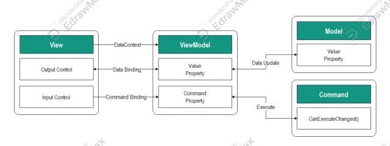
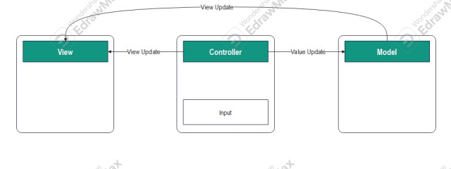
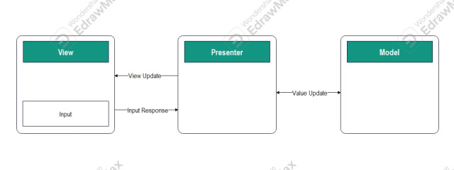

# 이력
- 2024年05月23日(水) - 최초작성

# MVVM 개론

Model, View, ViewModel 부류로 나누는 디자인패턴.

- Model: 데이터를 담는 객체
- View: 사용자에게 직접 보이는 부분
- ViewModel: View와 Model 중간다리를 하는 객체로, View에 Model을 바인딩해서 값을 표기해주고, View에서 변동된 값을 Model로 바인딩 해줌.

## 동작 및 장단점

- 동작
    1. Veiw에 Input이 들어옴
    2. View에 들어온 Input을 Command패턴으로 ViewModel에 전달
    3. ViewModel은 Model에게 데이터 요청
    4. Model은 ViewModel에게 데이터 전송
    5. ViewModel은 데이터를 가공하여 전송
    6. View에는 ViewModel이 가공한 데이터를 데이터 바인딩하여 화면에 표출
- 장점
    - View - Model 간 의존성이 없음.
        - ViewModel이 View와 Model 사이에서 데이터바인딩을 통해 Model의 값을 View에 표출함.
    - View - ViewModel 간 의존성이 없음.
        - Command 패턴과 데이터 바인딩을 사용하여, 서로 간의 의존성이 없음.
    - 대규모 프로젝트에 적합함.
        - 각각의 부분이 독립적이기에 모듈화하여 개발하기 좋음.
    - UI를 별도의 코드 수정 없이 재사용 가능.
    - 단위 테스트에 용의하다.
        - 의존성이 거의 없는 특성 덕에 단위 테스트에 용의하다.
- 단점
    - 데이터 바인딩을 위주로 고안된 패턴인 만큼, 데이터 바인딩이 불가능한 프로젝트에선 사용하기 어려움.
    - ViewModel의 설계가 쉽지 않다.
    - 메모리 낭비
        - 규모가 작어도 데이터 바인딩을 통한 쓸모없는 메모리 사용이 존재하고, 규모가 커진다면 더 많은 양의 메모리가 불필요하게 낭비되기 쉽다.

## 다른 디자인 패턴과 비교

### vs MVC

Model, View, Controller 부류로 나누는 디자인패턴.

- 동작
    1. Controller에 Input이 들어옴
    2. Controller는 Input을 확인하고, Model을 업데이트 함
    3. Controller가 Model을 표출할 View를 선택
    4. View는 Model을 이용해 화면에 표출
- 장점
    - 수십년간 호황을 누리며 누적된 사용으로 인해서 적응이 쉽고, 자료가 많다.
    - 직관적인 구조이기에 어렵지 않다.
    - 직관적인 구조 덕분에 작은 규모의 프로젝트에 적합.
- 단점
    - View - Model 간 의존성이 높음.
        - Model이 View에 표출된 값을 갱신해줘야하는 구조 특성상 View - Model 간 의존성이 심하게 발생함.
        - 의존성이 높아서 프로젝트가 거대해질 수록 복잡해지기 쉽고, 그로인해 유지보수의 난이도가 올라감.
    - Controller가 비대해지기 쉽다.
    - 단위 테스트가 어렵다.
        - View - Model 간 의존성이 높고, Controller가 비대해지기 쉬워, 단위 테스트가 어렵다.

### vs MVP

Model, View, Presenter 부류로 나누는 디자인 패턴.

- 동작
    1. View에 Input이 들어옴
    2. View가 Presenter에게 Input에 대한 작업 요청
    3. Presenter는 Model에게 데이터를 요청
    4. Model은 Presenter에 요청받은 데이터를 전송
    5. Presenter는 View에 데이터를 전송
    6. View는 받은 데이터를 화면에 표출
- 장점
    - View - Model 간 의존성이 없음.
        - Model의 값을 Presenter가 View에 전달/표울하는 형태이기에 의존성이 없음.
- 단점
    - View - Presenter 간 의존성이 높음.
        - Model이 하던 역할을 Presenter가 하게된 만큼, 의존성이 Presenter로 옮겨가기만 한 경향이 강함.
        - View와 Presenter는 1:1관계라 의존성이 높은 태생을 갖고 있음.
    - 단위 테스트가 어렵다.
        - View - Presenter 간 의존성이 높아 단위 테스트가 어렵다.