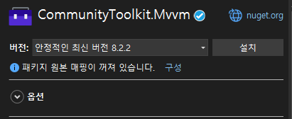

# 이력
- 2024年06月05日(水) - 최초작성

# 개요

WPF는 기본적으로 Property와 Control(GUI 요소)간의 Binding이 아주 용이한 구조로 되어있다.

그만큼 Binding 종류 및 옵션도 많아서, 추후의 개발 편의성을 위해 정리한 문서다.

- **서술 사전 설명**
    - 바인딩에 대한 방법만 서술하겠다.
    - xaml의 경우 Window 내부의 태그들만 예제를 만들 것이며, Window에 추가해야 할 속성값은 모두 주석으로 적겠다.
    - C#의 경우에도 상당수는 Class 내부의 요소만을 서술하겠다.
- **바인딩이란?**
    - UI와 Data를 연결하는 것.
- **기타 주의사항**
    - x:Name과 Name은 WPF 내부에서 작동하는 방법이 다름.

## 서술환경

### 라이브러리



해당 문서의 예제에서 사용되는 라이브러리다.

MS사에서 공식적으로 지원하는 WPF MVVM패턴 지원 라이브러리다.

<br/>

### 폴더구조


폴더는 상단 이미지처럼 구성한 상태에서 설명하고 있다.

해당 문서에서 실질적으로 사용되는 폴더는 **Converters, ViewModels, Views**정도다.

<br/>

### App.xaml

``` xml
<Application x:Class="ProjectName.App"
             xmlns="http://schemas.microsoft.com/winfx/2006/xaml/presentation"
             xmlns:x="http://schemas.microsoft.com/winfx/2006/xaml"
             xmlns:local="clr-namespace:ProjectName"
             StartupUri="Views/MainWindow.xaml">
    <Application.Resources>
    </Application.Resources>
</Application>
```

Project명은 편의상 ProjectName으로 하겠다.


# Binding 방법

## ElementName

**MainWindow.xaml**
```xml
<WrapPanel>
    <Button
        x:Name="button"
        Width="100" Height="50"/>
    <TextBox
        Width="{Binding Path=Width, ElementName=button}"
        Height="{Binding Path=Height, ElementName=button}"/>
</WrapPanel>
```

위와 같이 하면, TextBox는 button이란 이름을 가진 Button과 동일한 크기가 된다.

ElementName을 지정하면, 같은 xaml파일 내 Control의 Property값을 Binding할 수 있다.

## TagOnly

**xaml 내 Binding**
``` xml
<TextBox>
    <TextBox.Text>
        <Binding Path="Title" ElementName="WindowName"/>
    </TextBox.Text>
</TextBox>
<!--상하 결과 동일-->
<TextBox Text="{Binding Title, ElementName=WindowName}"/>
<!--상하 결과 동일-->
<TextBox Text="{Binding Path=Title, ElementName=WindowName}"/>
```

**ViewModel과 Binding**
```xml
<TextBox>
    <TextBox.Text>
        <Binding Path="Title"/>
    </TextBox.Text>
</TextBox>
<!--상하 결과 동일-->
<TextBox Text="{Binding Title}"/>
<!--상하 결과 동일-->
<TextBox Text="{Binding Path=Title}"/>
```

WPF에서 GUI 요소의 Option은 한 줄로 정의할 수도, 아니면 자식 태그를 늘리는 식으로 만들 수도 있다.

기본적으로 Binding할 때, Binding 이후에 옵션명이 안 들어가고 값만 덜렁있으면, Path의 값으로 인식한다.\
StaticResource등도 동일.

**※ 중괄호({, })를 사용하는 방법에 대한 별도 명칭이 존재하는지는 모르겠다.**


## DataContext 사용

**MainWindow.xaml**
``` xml
<!--xmlns:vm="clr-namepace:ProjectName.ViewModels"-->
<Window.DataContext>
    <vm:ViewModel/>
</Window.DataContext>
<Grid>
    <Label Content="{Binding Proto, Mode=OneWay, UpdateSourceTrigger=PropertyChanged}"/>
</Grid>
```

**MainViewModel.cs**
``` csharp
public string Proto
{
    get => _proto;
    set => SetProperty(ref _proto, value);
}
private string _proto;
```

DataContext에 지정된 ViewModel의 Property와 Binding하는 방법이다.

Mode, UpdateSourceTrigger등의 Option은 후술.


# 확장 태그

## WPF 관련 태그 확장

### Binding

Property의 값과 Binding하겠다는 의미.

<br/>

### StaticResource

상위 GUI요소의 Resources에 정의한 Resource의 고정된 값을 Binding하겠다는 의미.

<br/>

### DynamicResource

상위 GUI요소의 Resources에 정의한 Resource의 변경될 수 있는 값을 Binding하겠다는 의미.

변경되면, Binding처럼 갱신됨.

## XAML 정의 태그 확장

### x:Static

### x:Type

### x:Array

### x:Null


# Binding Option

## Path

바인딩할 값을 정의한다.

**※ 생략 가능.**

<br/>

## ElementName

바인딩을 할 요소를 정의한다.

ElementName을 정의하지 않으면, DataContext로 지정된 ViewModel이라고 정의한다.

<br/>

## Mode

GUI와 Property 사이의 바인딩 방향을 어떻게 할 것이지 정의한다.

- 바인딩 모드는 바인딩 구문에 **Mode=** 를 추가해서 지정한다.
- **OneWay:** Property -> View 단방향만 동기화
- **TwoWay:** Property <-> View 양방향 동기화
- **OneWayToSource:** Property <- View 단방향만 동기화
- **OneTime:** Property -> View 단방향으로 단 1회 동기화
- **Default:** View에서 수정이 가능하면 **TwoWay**가, View에서 수정이 불가능하면 **OneWay**가 된다.

<br/>

## UpdateSourceTrigger

GUI를 바인딩 대상인 Property와 어느 시점에 갱신할 지에 대한 트리거를 정의한다.

- **PropertyChanged:** 바인딩 대상이 갱신될 때마다 업데이트.
- **LostFocus:** 바인딩 대상인 View가 Focus를 잃을 때마다 업데이트.
- **Explicit:** _UpdateSource()_ Method를 호출할 때마다 업데이트.
    - ex)
        ``` csharp
        textBox.GetBindingExpression(TextBox.TextProperty).UpdateSource();
        ```
- **Default:** Text속성의 기본값은 **LostFoucs**가, 나머지 대부분은 **PropertyChanged**가 된다.

<br/>

## Converter

Binding한 값을 그대로 GUI에 표출하는 게 아니라, 가공을 먼저 하기 위해 사용하는 Option

### 예제

1. **ViewModel 작성**

    **MainViewModel.cs**
    ``` csharp
    public int Number
    {
        get => _number;
        set => SetProperty(ref _number, value);
    }
    private int _number;

    public MainViewModel()
    {
        Number = 5;
    }
    ```

    ViewModel은 값의 변화를 보기만을 위해 Number라는 Property를 생성한 후, 5를 대입하겠다.

    <br/>

2. **Converter 작성**

    **TestConverter.cs**
    ``` csharp
    public class TestConverter : IValueConverter
    {
        // Property -> GUI
        public object Convert(object value, Type targetType, object parameter, CultureInfo culture)
        {
            string result = "Convert 실패시 표출될 값";
            if (value != null && value is int num)
            {
                num *= 2;

                result = num.ToString();
            }

            return result;
        }

        // GUI -> Property
        public object ConvertBack(object value, Type targetType, object parameter, CultureInfo culture)
        {
            int result = 0;
            if (value != null && value is string str)
            {
                int num;
                int.TryParse(str, out num);
                num *= 2;

                result = num;
            }

            return result;
        }
    }
    ```

    Binding에 사용되는 Converter는 IValueConverter라는 Interface를 무조건 상속받아야 한다.\
    Convert, ConvertBack 두 Method를 기본적으로 갖고있는 Interface다.

    - **Convert:** 주석에 쓰인 것처럼 Property측에서 GUI로 표출되는 표출될 때 적용된다.
    - **ConvertBack:** 주석에 쓰인 것처럼 GUI상에서 값이 변경돼서 Property측으로 값이 돌아갈 때 적용된다.

    <br/>

3. **Window.xaml 수정**

    **MainWindow.xaml**
    ``` xml
    <!--xmlns:vm="clr-namepace:ProjectName.ViewModels"-->
    <!--xmlns:cvt="clr-namepace:ProjectName.Converters"-->
    <Window.DataContext>
        <vm:MainViewModel/>
    </Window.DataContext>
    <Window.Resources>
        <cvt:TestConverter x:Key="IntConverter"/>
    </Window.Resources>
    <WrapPanel>
        <TextBox Width="100" Text="{Binding Path=Number, Mode=TwoWay, UpdateSourceTrigger=LostFocus, Converter={StaticResource IntConverter}}"/>
        <Label Content="{Binding Path=Number}"/>
        <TextBox Width="100"/>
    </WrapPanel>
    ```

    Converter는 사용하기 위해, Resources에 등록해야 한다.

    TextBox 2개, Label 1개를 등록했다.

    - **상단 TextBox**
        - Converter가 적용된 TextBox로, Number Property의 값이 표출될 때도 Convert를 거치고, 값을 변경했을 때도 Converter를 거친다.
        - Mode를 TwoWay로 했기 때문에 값을 사용자가 변경했을 때 Property가 영향을 받는다.
        - UpdateSourceTrigger를 LostFoces로 선언해서, 적용되길 바라는 시점에 다른 UI로 Focus를 옮겨야 한다.
    - **Label**
        - Convert를 거치지 않은 Property 값이 보이는 GUI 요소.
        - 실제 값을 확인하는 부분이다.
    - **하단 TextBox**
        - Focus를 옮기기 위해 존재하는 GUI 요소.

4. **결과 확인**

    1. **시작 화면**

        

        보는 것처럼 Label에는 Number Property의 초기값인 5가 표출되지만, Converter가 적용돼서, Property 값의 2배를 표시하게 된 TextBox는 10으로 표시된다.

    2. **값 변경**

        

        좌측에 Number Property와 Binding된 TextBox의 값을 수정한 후.

    3. **값 변경 확인**

        

        마우스로 우측의 TextBox를 클릭하면, Binding된 TextBox의 LostFocus Event가 작동하면서 Property의 값이 TextBox에 적었던 5란 숫자가 Conveter에 의해 10으로 바뀐 채로 들어갑니다.

        Property가 변경된 후엔 TextBox의 값도 바뀌어서 20으로 바뀝니다.