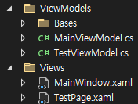
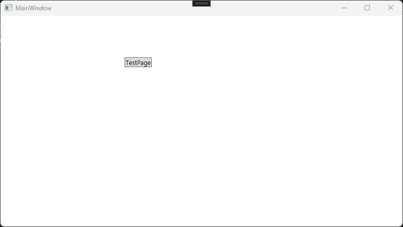
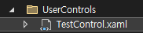
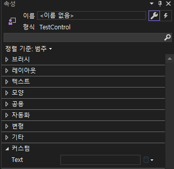

# 이력

- 2024年05月31日(金) - 최초작성


# UserControl 시작

> ※ .NET8 및 WPF, MVVM 패턴을 기준으로 서술됨.

UserControl(이하 UC)은 WPF 및 WinForm등에서 지원하는 말그대로, User(개발자)가 만들어서 사용하는 Control(WPF/WinForm에서 사용되는 UI 요소)이다.

## 용도

- UC를 MDI 구조를 구성할 때, Child로 사용하는 경우도 있다.
    - ※ MDI 구조란, ParentWindow라는 파일 내부에 별도의 파일로 지정된 ChildView가 표출되는 형태로, 공통 부분을 제외하고 내부 페이지 별로 나눠서 개발하기 위해 주로 사용되는 구조를 의미.
    - ※ Page로 구성하는 경우도 있지만, UC로 하는 걸 더 권장하는 경향이 있는 듯하다.
- 자주 사용하는 복잡한 구조의 UI를 그룹화/라이브러리화 해서, XAML 코드의 길이를 줄이기 위해서.


# Paging

UserControl을 MDI구조로 작성하기위해 사용하는 방법에 대한 서술.

1. **파일생성**

    

    먼저 상기 이미지처럼 **Views** 폴더에 **MainWindow.xaml**과 **TestPage.xaml**을 생성.

    - **MainWondow.xaml:** Window형태로 생성해야 함.
    - **TestPage.xaml:** UserControl형태로 생성해야 함.

2. **App.xaml에 Resources 추가**

    **App.xaml**
    ``` xml
        <Application x:Class="WpfTest.App"
             xmlns="http://schemas.microsoft.com/winfx/2006/xaml/presentation"
             xmlns:x="http://schemas.microsoft.com/winfx/2006/xaml"
             xmlns:vm="clr-namespace:WpfTest.ViewModels"
             xmlns:view="clr-namespace:WpfTest.Views"
             xmlns:local="clr-namespace:WpfTest"
             StartupUri="Views/MainWindow.xaml">
            <Application.Resources>
                <!--추가 시작-->
                <DataTemplate DataType="{x:Type vm:TestViewModel}">
                    <view:TestPage/>
                </DataTemplate>
                <!--추가 끝-->
            </Application.Resources>
        </Application>
    ```

    상기 코드처럼 **App.xaml** 파일에 **Application.Resources** 태그 내부에 주석 사이에 존재하는 **DataTable** 태그를 작성.

    - Application 태그에 **xmlns:vm**, **xmln:view**를 추가.
        - 해당 속성을 추가하는 이유는 **DataTemplate**을 추가할 때 사용할 경로가 필요해서.
    - DataTemplate 태그의 DataType 속성을 추가해서 상기처럼 추가.
        > {x:Type vm:TestViewModel}
        - 해당 속성값에서 **vm:TestViewModel** 부분이 ViewModel을 지정하는 부분.
        - vm 네임스페이스의 TestViewModel Class라는 의미.
    - DataTemplate 태그의 자식 태그로 **view:TestPage** 태그를 추가.
        - view 네임스페이스의 TestPage라는 UserControl과 부모의 속성값에 해당하는 Class를 연결.

3. **C# 코드 수정**

    **TestViewModel.cs**
    ``` csharp
    public class TestViewModel: ObservableObject
    {
        
    }
    ```

    **TestViewModel.cs**의 경우에는 **ObservableObject**라는 Class를 상속한다.

    만약 해당 Class가 보이지 않는다면, Nuget에서 **CommunityToolkit.Mvvm**(이하 CTMVM)이라는 라이브러리를 추가하고, 종속성 설정을 한 후 다시 시도한다.

    <br/><br/>

    **MainViewModel.cs**
    ``` csharp
    public class MainViewModel: ObservableObject
    {
        public ObservableObject CenterPage
        {
            get => _centerPage;
            set => SetProperty(ref _centerPage, value);
        }
        private ObservableObject _centerPage;

        public MainViewModel()
        {
            CenterPage = new TestViewModel();
        }
    }
    ```

    **MainViewModel.cs**도 **ObservableObject**라는 클래스 상속 후, CenterPage라는 프로퍼티를 생성한다.

    - 라이브러리 설명
        - **CommunityToolkit.Mvvm:** WPF에서 MVVM 패턴을 적용하는 데 도움을 주는 MS사 공식 지원 라이브러리.
        - **ObservableObject:** CTMVM 라이브러리에서 제공하는 Class로 SetProperty와 같은 바인딩을 도와주는 보조 Method 등이 존재한다.
    - **ObservableObject CenterPage:** 데이터 바인딩을 위해 사용될 Property.
    - **SetProperty(ref _centerPage, value):** Property가 가리키는 변수의 값이 변경됐을 때, 다시 재바인딩을 하라고 호출을 포함하는 Method.

4. **바인딩 확인용 태그 추가**

    **TestPage.xaml**
    ``` xml
    <Button Content="TestPage" HorizontalAlignment="Left" VerticalAlignment="Top"/>
    ```
    위 태그를 **TestPage.xaml** 내, Grid 태그의 자식으로 추가.

    ※ 중요한 이유가 있는 것은 아니고, 단순히 UserControl 바인딩을 확인하기 위함입니다.

5. **UserControl 바인딩**

    **MainWindow.xaml**
    ``` xml
    <Window x:Class="WpfTest.MainWindow"
        xmlns="http://schemas.microsoft.com/winfx/2006/xaml/presentation"
        xmlns:x="http://schemas.microsoft.com/winfx/2006/xaml"
        xmlns:d="http://schemas.microsoft.com/expression/blend/2008"
        xmlns:mc="http://schemas.openxmlformats.org/markup-compatibility/2006"
        xmlns:vm="clr-namespace:WpfTest.ViewModels"
        xmlns:local="clr-namespace:WpfTest"
        mc:Ignorable="d"
        Title="MainWindow" Height="450" Width="800">
        <Window.DataContext>
            <vm:MainViewModel/>
        </Window.DataContext>
        <Grid>
            <ContentControl Height="250" Width="300" Content="{Binding CenterPage}"/>
        </Grid>
    </Window>
    ```
    
    먼저, **MainViewModel.cs**를 바인딩할 DataContext로 지정한다.

    그 후, **ContentControl**태그의 **Content** 속성에 **UserControl**을 바인딩 한다.

    - **Window.DataContext:** DataContext를 지정하는 태그.
        - DataContext지정은 해당 태그 사용 외에도 여러 방법이 존재함.
    - **ContentControl:** UI 요소 내부의 Content를 지정하기 위해 사용하는 태그.
        - 주로 Button 등의 UI 요소 내부에 이미지를 넣는 등의 행동을 위해서 사용함.
        - 현재 xaml파일에는 UserControl을 바인딩하기위해서 사용함.
    - **{Binding CenterPage}:** DataContext의 CenterPage라는 Property와 바인딩하겠다는 의미.

6. **결과**

    

    정상적으로 실행된다면, 상기 이미지처럼 별도의 Button을 선언하지 않았는데도 UserControl을 UI 내에 덧그려서 위와 같이 나올 거다.


# CustomControl

UserControl을 사용하여, CustomControl을 만드는 간소한 과정을 서술.

이미지 버튼을 만드는 과정으로 서술하겠음.

1. **파일생성**

    

    먼저 상기 이미지처럼 **UserControls** 폴더에 **TestControl.xaml**을 생성.

    파라메터를 적용하는 단순한 예제를 위해서, 단순히 Label 1개가 들어가는 UserControl을 만들 거다.

    **※ UserControl은 다른 객체들과는 달리 View/Model/ViewModel 등을 이름에 붙이지 않고, UI의 이름만을  간결하게 적는 것을 권장.**\
    **ex) ImageButton, TextProgressBar**

2. **UserControl, 코드 비하인드 수정**

    **TestControl.xaml.cs**
    ``` csharp
    [Category("커스텀"), Description("텍스트")]
    public string Text
    {
        get => _text;
        set => _text = value;
    }
    private string _text;
    ```

    위 코드를 **TestControl.xaml.cs**에 추가한다.

    이제 TestControl에는 **Text**라는 Parameter가 추가된 거다.

    - **[]:** 대괄호에 들어간 코드는 UserControl의 Parameter를 GUI 상에서 표현하는 부분.\
        
        - **Category:** GUI Parameter의 그룹명.
        - **Description:** Parameter 설명.

3. **View xaml 수정**

    **TextControl.xaml**
    ``` xml
    <!--x:Name="root"-->
    <Grid>
        <Label Content="{Binding Text, ElementName=root}"/>
    </Grid>
    ```

    상단의 주석은 UserControl의 Window의 속성으로 추가한다.

    이제 UserControl의 Text Parameter를 수정하면, 내부의 Label의 Content값이 바뀐다.

    하지만, 현재 상황에서는 **TestControl's Parameter <-> ViewModel's Property**의 정상적인 Binding 처리를 하지 못한다.


4. **의존 프로퍼티 추가**

    **TestControl.xaml.cs**
    ``` csharp
    [Category("커스텀"), Description("텍스트")]
    public string Text
    {
        get => (string)GetValue(_sourceProperty);
        set => SetValue(_sourceProperty, value);
    }
    private static readonly DependencyProperty _sourceProperty =
        DependencyProperty.Register("Text", typeof(string), typeof(TestControl));
    ```

    UserControl이 외부의 Property와 정상적인 Binding을 할 수 있게 수정했다.

    - **GetValue, SetValue:** 의존 프로퍼티에서 값을 **조회/변경**할 때 사용되는 Method.
    - **DependencyProperty:** 의존 프로퍼티로 Property 값이 변경됐을 때, 자동으로 처리하게 할 수 있게 해주는 것이다.
        - **"Text":** Binding 등에 사용할 Property명을 넣어야 한다.
        - **typeof(string):** Property의 Type이다.
        - **typeof(TestControl):** 해당 의존 프로퍼티를 사용할 클래스명이다.