# 이력
- 2024年05月23日(木) - 최초작성
- 2024年05月24日(金)
    1. 권장 Command구조 변경
    2. 데이터 바인딩 예제 추가, 대본 파일명 추가
- 2024年05月27日(月) - 오타 수정


# WPF 개론

> ※ .NET8기준으로 서술됨.\
> ※ 해당 문서는 MVVM패턴을 기준으로 서술하려고 노력함.

MS 사에서 개발한 Window에 최적화 된 Application GUI 개발 툴.

WinForm과는 비슷한 영역에서 활동하나 장단점은 상당히 상이함.


## WinForm과 비교

### WPF
- 장점
    - 최신 기준에 부합하다.
    - 유연한 GUI를 구성할 수 있다.
    - XAML을 사용하므로 완전한 디자인과 개발의 업무 분리가 가능하다.
    - 데이터와 레이아웃을 구분하여 바인딩 가능하다.
    - 하드웨어 가속으로 속도가 빠르다.
    - 대규모 프로젝트에 유리하다.
- 단점
    - 개발속도가 WinForm에 비하면 느리다.
    - 프로젝트 상에서 감춰진 부분이 적지 않다.
    - 기본적으로 구성된 GUI가 없는 것에 가깝다.

### WinForm
- 장점
    - 오래된 만큼, 검증된 기술이 많다.
    - 예제를 찾기 쉽다.
    - 지원하는 외부 라이브러리/컨트롤이 많다.
    - 개발 속도가 빠르다.
- 단점
    - 기본 GUI가 많이 올드하다.
    - GUI가 유연하지 않다.
    - 디자인이 별도 파일이 아닌, CS에 코드로 인해 생성되므로 디자인과 개발의 완벽한 업무 분리는 힘들다.

### 결론

GUI에 신경쓸 필요가 없거나, 소규모 프로젝트에는 WinForm이 더 낫고.

GUI에 투자가 필요하거나, 대규모 프로젝트에는 WPF가 더 낫다.

## WPF에서 추천되는 디자인 패턴

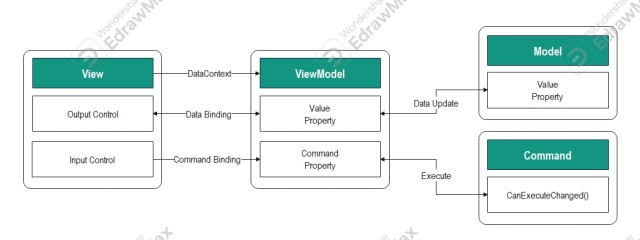

WPF에서는 MVVM이라는 디자인 패턴이 추천된다.

다른 이유도 많지만, 가장 큰 요인은 WPF 자체가 데이터 바인딩이 용이한 구조로 구성되어서라고 생각한다.


MVVM패턴을 WPF 프로젝트에서 구성하는 걸 도와주는 외부라이브러리는 많지만, 그 중에서도 MS사에서 지원하는 **CommunityToolkit.Mvvm**을 기준으로 설명하고자 한다.

**MVVM Light**도 존재하지만, WPF라는 GUI개발툴을 지원하는 MS사에서 권장하는 게 상기한 **CommunityTookit.Mvvm**(이하 CTMVM으로 표기)이기 때문이다.


# WPF 프로젝트 구성

각 요소별 구성 및 구조를 설명.


## 권장 폴더 구조

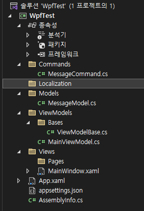

UserControl을 담는 폴더는 제외하고 서술.

- Commands(표준)
    - ICommand를 상속받는 Command를 넣는 폴더.
- Localization(비표준)
    - .NET에는 여러방식의 지역화를 지원하기에 굳이 폴더명을 이렇게 짓지 않아도 되는 걸로 알고있음.
    - **Resources**라고 지어도 무방할 것으로 보이나, 리소스와 지역화는 별개로 나눠야한다고 판단해서 이번에는 **Localization**이라고 명명함.
- Models(표준)
    - **Model**이라고도 지으나, 표준은 **Models**로 보임.
- ViewModels(표준)
    - **ViewModel**이라고도 지으나, 표준은 **ViewModels**로 보임.
    - Bases(비표준)
        - CTMVM의 인터페이스를 상속받아서 다른 ViewModel에게 상속될 클래스를 놓는 곳.
        - 인터페이스를 곧바로 사용하는 것보다 Base를 만들고 그 Base를 상속하게 하는 게 확장성 및 유지보수가 좋기에 권장하는 곳이 종종 보임.
        - ViewModel이 설계가 어려워서 복잡해지기 쉬워서 그런 점이 있는 것 같기도 함.
- Views(표준)
    - Window.xaml이나, Page.xaml처럼 GUI를 구성하는 Parent가 되는 요소가 담기는 폴더.
    - Pages(비표준)
        - Page가 늘어날 수도 있기 때문에 View 내에서도 따로 분리해서 보관하기로 판단함.


## 고정 요소

### App.xaml

프로그램이 시작하면, Show할 Window.xaml을 설정하는 등의 시작점이 되는 파일.

WPF 프로젝트에서 무조건 한 개가 존재하는 파일이기 때문에 전역변수를 넣기에 좋아보임.

### AssemblyInfo.cs

프로젝트의 어셈블리 정보들이 들어간 파일.

기본적으로 생성되어 있음.

### appsettins.json

.NET에서 권장하는 Config파일.

기존에는 Web.Config, App.Config, 혹은 ini파일이 담당하던 프로그램의 설정 파일을 최근에는 json로 관리하는 것을 표준으로 삼음.

파일명은 위와 같이 **appsettings.json**이 표준임.

**기본적으로 생성되는 파일이 아니므로, 직접 생성해야 함.**


## 생성형 요소

별도로 생성해서 사용하는 요소들에 대한 설명.

### Window

View부분을 담당하는 요소.

실질적인 GUI의 요소들인 Control들을 표시할 영역을 담당하는 요소.

- **CustomWindow.xaml**
    - GUI의 요소들을 배치하는 것에 대한 것을 적는 부분.
    - 확장자가 말하는 것처럼 XML로 작성됨.
    - 데이터 바인딩에 대한 부분 및 커맨드 패턴을 지시하는 부분임.
- **CustomWindow.xaml.cs**
    - GUI의 View부분 C#코드.
    - ViewModel을 DataContext에 기입하는 걸 이 부분에서 하는 것을 권장함.
        - xaml에서도 가능은 하지만, xaml에서 표기하는 건 가시성이 떨어지고, 명확하게 인지하기 힘들어서로 추정됨.
- **CustomWindow.g.i.cs**
    - 프로젝트 상에서 숨겨진 부분.
    - GUI의 View부분 중에서도 xaml코드를 GUI로 구현하는 InitializeComponent() Method가 정의된 부분.
    - 굳이 볼 필요는 없음.

### Page

View부분을 담당하는 요소.

Window 안에 영역을 별도로 만들어서 사용하고 싶을 때 사용하는 요소.

구조는 **Window**와 대동소이 하기에 별도 서술은 생략.

### UserControl

View부분을 담당하는 요소.

Window와 Page 내에서 Button등의 요소를 만들거나, 그룹화할 때 생성하는 요소.

구조는 **Window**와 대동소이 하기에 별도 서술은 생략.


## View와 ViewModel 연결 및 데이터 바인딩

상기했든 CTMVM 라이브러리를 적용한 것을 기준으로 설명하고자 한다.

1. **파일 생성**

    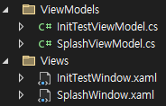

    위와 같이 Views 폴더에는 Window를, ViewModels 폴더에는 ViewModel을 생성합니다.

    View와 ViewModel이 반드시 1:1로 매칭되지는 않고, 필요에 따라 View 1개에 n개의 ViewModel이 붙기도 한다.

    네이밍 방법에는 여러 방법이 있지만, View/ViewModel/Model 등을 구분하기 쉽게 이름에 붙이는 것도 권장되는 방법 중 하나라고 한다.

2. **ViewModel연결(XML에서)**

    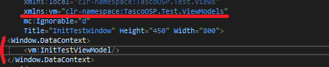

    디자인 쪽인 .xaml파일에서 DataContext와 연결하는 방법으로 별도의 코드 비하인드 수정 없이 작성할 수 있다.

    하지만, **&lt;Window&gt;** 태그까지 확인해야 하는 등, 명확하지 못해서 **후술할 방법**으로 연결하는 것을 권장하는 경우가 많았다.

3. **ViewModel연결(코드에서)**
    ``` csharp
    public InitTestWindow()
    {
        InitializeComponent();
        this.DataContext = new InitTextViewModel();
    }
    ```
    디자인 파일의 코드 비하인드에서 DataContext와 연결하는 방법으로 별도의 코드 수정이 필요하다.

    상술한 xaml파일에서 하는 것보다 비교적 명확해서 이 방법을 권장하는 경우가 많았다.
    - **(번외)** 그 외에도 다른 방법으로도 연결할 수 있지만, 생략하겠다.

4. **데이터 바인딩**
    
    **.xaml.cs**
    ``` csharp
    public class ViewModel: INotifyPropertyChanged
    {
        private IList<TestModel> _proto;
        public IList<TestModel> Proto
        {
            get => _proto;
            set => SetProperty(ref _proto, value);
        }

        // 이하 생략
    }

    public class TestModel
    {
        private string _text;
        public string Text
        {
            get => _text;
            set => SetProperty(ref _text, value);
        }

        // 이하 생략
    }
    ```

    **.xaml**
    ``` xml
    <Grid>
        <Label Content="{Binding Proto[0].Text, Mode=OneTime, UpdateSourceTrigger=PropertyChanged}"/>
        <Label Content="{Binding Proto[1].Text, UpdateSourceTrigger=PropertyChanged}"/>
        <Label Content="{Binding Proto[2].Text, UpdateSourceTrigger=PropertyChanged}"/>
        <Label Content="{Binding Proto[3].Text, UpdateSourceTrigger=PropertyChanged}"/>
    </Grid>
    ```
    - 데이터 바인딩을 하는 구문은 **{** 에서 시작해서 **}** 에서 끝난다.
    - **Binding**을 서두에 적음으로 해당 구문이 데이터 바인딩 구문임을 표시한다.
    - **Binding**
        - ViewModel의 어떤 Property를 바인딩할지 정의한다.
    - **Mode**
        - 바인딩 모드를 정의한다.
        - **바인딩 모드**
            - 바인딩 모드는 바인딩 구문에 **Mode=** 를 추가해서 지정한다.
            - **OneWay:** Property -> View 단방향만 동기화
            - **TwoWay:** Property <-> View 양방향 동기화
            - **OneWayToSource:** Property <- View 단방향만 동기화
            - **OneTime:** Property -> View 단방향으로 단 1회 동기화
            - **Default:** View에서 수정이 가능하면 **TwoWay**가, View에서 수정이 불가능하면 **OneWay**가 된다.
    - **UpdateSourceTrigger**
        - 갱신 트리거를 정의한다.
        - **업데이트 소스 트리거**
            - **PropertyChanged:** 바인딩 대상이 갱신될 때마다 업데이트.
            - **LostFocus:** 바인딩 대상인 View가 Focus를 잃을 때마다 업데이트.
            - **Explicit:** _UpdateSource()_ Method를 호출할 때마다 업데이트.
                - ex)
                    ``` csharp
                        textBox.GetBindingExpression(TextBox.TextProperty).UpdateSource();
                    ```
            - **Default:** Text속성의 기본값은 **LostFoucs**가, 나머지 대부분은 **PropertyChanged**가 된다.

5. **커맨드 바인딩**
    ``` csharp
    public class TestCommand : ICommand
    {
        public event EventHandler? CanExecuteChanged;

        public bool CanExecute(object? parameter)
        {
            return true;
        }

        public void Execute(object? parameter)
        {
            Debug.WriteLine("Test123");
        }
    }
    ```
    **ICommand** interface는 아래 구조와 같다.
    - EventHandler? CanExecuteChanged
        - ICommand를 상속받은 객체를 바인딩했을 때, 처음 호출하는 핸들러.
        - 존재만 하면 되는 것으로 보임.
    - bool CanExecute(object? parameter)
        - EventHandler가 해당 Execute를 동작시킬 수 있는지, 먼저 확인하기 위해 존재하는 Method.
        - 매개변수를 받아서 참조하거나, 생성자에서 bool을 받는 식으로 해당 Command를 동작시킬지 판단하게 하는 것이 좋아보임.
    - void Execute(object? parameter)
        - 실제 의도한 동작이 정의되는 부분.

    **Command**는 _ICommand_ interface를 상속받아야, 바인딩이 가능함.

    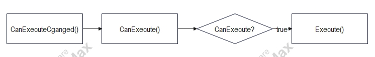

    Command는 호출 시, 위와같은 순서로 동작한다고 함.

    ``` xml
    <Button Content="Button" Width="100" Height="100" Command="{Binding TestCommand}"/>
    ```

    바인딩 방법은 **데이터 바인딩**과 동일하다.

6. **권장 커맨드 구조**

    ``` csharp
    // RelayCommand.cs
    public class RelayCommand(Action<object?> executeMethod, Predicate<object?>? canExecute = null): ICommand
    {
        public event EventHandler? CanExecuteChanged;

        public bool CanExecute(object? parameter)
        {
            return canExecute == null || canExecute(parameter);
        }

        public void Execute(object? parameter)
        {
            executeMethod(parameter);
        }
    }
    
    // TestViewModel.xaml.cs
    public partial class TestViewModel
    {
        private ICommand? _testCommand;
        public ICommand TestCommand
        {
            get => _testCommand ??= new RelayCommand(TestMethod);
        }

        private ICommand? _test2Command;
        public ICommand Test2Command
        {
            get => _test2Command ??= new RelayCommand(Test2Method, IsCan);
        }

        private void TestMethod(object? parameter)
        {
            Debug.WriteLine($"{parameter}");
        }

        private void Test2Method(object? parameter)
        {
            Debug.WriteLine($"{parameter}");
        }

        private bool IsCan(object? parameter)
        {
            return true;
        }
    }
    ```

    권장하는 구조는 위와 같이 ICommand는 구조만 잡고, 실질적인 Execute는 ViewModel에서 작성하는 구조다.

    RelayCommand는 저렇게 짜놓고, 범용적으로 사용하는 경우가 잦은 것 같다.


# 지역화(다국어 지원) 방법


## 언어 지원

리소스 파일로 생성된 정적 리소스를 활용해서 하는 방법을 설명하고자 한다.

1. **리소스파일 생성**

    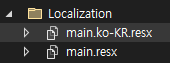

    위와 같이 Localization 폴더 아래에 리소스 파일(.resx)을 배치합니다.

    리소스 파일은 Filename.resx가 기본 언어(영어)의 대본이고, Filename.ko-KR.resx는 한국어 대본입니다.

2. **액세스 한정자 변경**

    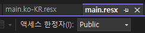

    대본이 작성된 리소스 파일은 위와 같이 액세스 한정자를 **Public**으로 변경해야 합니다.

    하지 않으면, View에서 불러올 수 없습니다.

3. **대본 작성**

    **main.resx**

    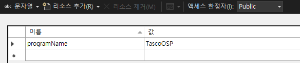

    **main.ko-KR.resx**

    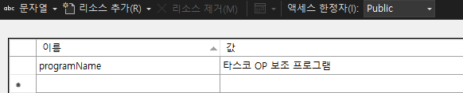

    View에서 대본을 읽어들일때는 **ResourceName.name**형태로 지정해서 읽어들이기 때문에 들어가는 key값은 일치시켜줘야합니다.

4. **지역화 등록**

    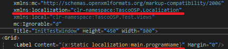

    다국어 처리를 해줄 View부분으로 가서, 먼저 **&lt;Window&gt;** 태그 부분에 붉은줄이 쳐진 것처럼 localization에 사용할 폴더를 등록해줍니다.

5. **적용**

    그다음에는 다국어 처리 중, 언어를 표출할 부분에 붉은 줄이 쳐진 것처럼 **x:Static**로 시작되는 정적 리소스를 불러들이는 작업을 해줍니다.

6. **확인**

    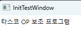

    프로그램을 빌드하면, 위처럼 언어 지원이 적용된 것을 확인할 수 있습니다.

7. **(번외)**

    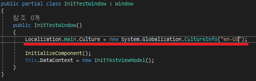

    다른 언어가 제대로 적용되는지 확인하고 싶으면, 붉은 줄을 쳐놓은 것처럼 리소스 파일에 적용된 Culture를 직접 바꿔주면 됩니다.

    주의사항으로는 **InitializeComponent()** Method가 GUI를 구성하는 Method이기 때문에 저 Method보다 먼저 Culture를 바꿔야합니다.

    **ex) en-US(영어), ko-KR(한국어), jp-JP(일본어) 등, 자세한 건 MS Document참조**